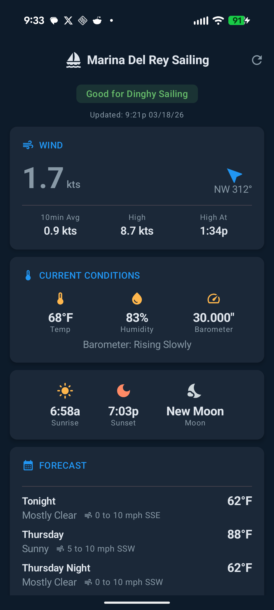
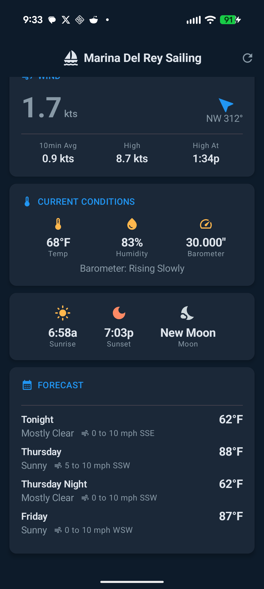

# Marina Del Rey Sailing Weather

A beautiful Android app that delivers real-time sailing weather conditions for Marina Del Rey. Built for sailors who want quick, glanceable weather data before heading out on the water.

## Features

- **Live Wind Data** — Current wind speed, direction with compass heading, 10-minute average, and daily high wind with timestamp
- **Current Conditions** — Temperature, humidity, and barometric pressure with trend indicator
- **Sun & Moon** — Sunrise, sunset times and current moon phase
- **Multi-Day Forecast** — Tonight and upcoming day/night forecast periods with temperature, wind speed, and conditions
- **Dinghy Sailing Indicator** — Green badge when conditions are suitable for dinghy sailing (8 knots or less)
- **Auto-Refresh** — Updates every 10 minutes to stay current with the latest readings
- **Pull-to-Refresh** — Manual refresh anytime with swipe or toolbar button
- **Dark & Light Mode** — Nautical-themed color palette that adapts to system theme

## Screenshots

<p align="center">
  
  &nbsp;&nbsp;
  
</p>

## Tech Stack

- **Kotlin** with Jetpack Compose
- **Material 3** (Material You) design system
- **MVVM** architecture with StateFlow
- **OkHttp** for networking
- **Kotlin Coroutines** for async operations

## Requirements

- Android 8.0 (API 26) or higher
- Samsung Galaxy and Google Pixel devices recommended

## Building

```bash
./gradlew assembleDebug
```

The debug APK will be at `app/build/outputs/apk/debug/app-debug.apk`.

## Install

```bash
adb install app/build/outputs/apk/debug/app-debug.apk
```

## License

All rights reserved.
